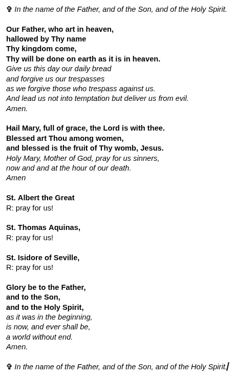
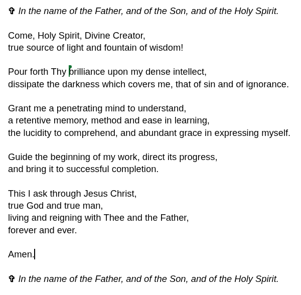

#+TITLE:Agenda - Intro to Programming (Python)
#+AUTHOR:Marcus Marcus Birkenkrahe
#+SUBTITLE:CS CS 100, Catholic Polytechnic University
#+STARTUP: overview hideblocks indent entitiespretty:
#+attr_html: :width 600px :float nil:
[[../img/breughel_babel_1563.jpg]]

* Prayers
** Opening Prayer (Standard)
#+attr_html: :width 550px :float nil:

** Closing Prayer (Aquinas)
#+attr_html: :width 550px :float nil:

** Why these prayers?

- *The "Our Father"*, because we learn everything through him.
- *The "Hail Mary"*, because we need trust and humility to learn.
- *St. Albert the Great*, because he is the patron saint of scientists,
  philosophers, and students of the natural sciences.
- *St. Thomas Aquinas*, because he is the patron saint of Catholic
  schools, universities, and scholars.
- *St. Isidore of Seville*, because he is the patron saint of students,
  scholars, the internet, computer users and encyclopedias.
- *A student's prayer* is by St. Thomas Aquinas.

* Week 1 - Overview and Getting Started with Python in Colab

- [X] Opening prayer
- [X] About your instructor
- [X] Syllabus walk-through
- [X] Course infrastructure
- [X] Assigned reading
- [X] Class workflow
- [X] Programming assignments
- [X] DataCamp assignments and walk-through
- [X] Getting started with Colab
- [X] Next assignments
- [X] Wrap-up
- [X] Closing prayer

** About your instructor

- Google me or ask AI.

- Ask me about anything you'd like to know.

** Syllabus walk-through

- Where can you find the syllabus?
  #+begin_quote
  You find the syllabus in Teams > General (main channel)
  #+end_quote

- What does your grade depend on?
  #+begin_quote
  Your grade depends on weekly online lessons, programming
  assignments, multiple-choice quizzes, and monthly mini-projects.
  #+end_quote

- What's new in this course?
  #+begin_quote
  + This is the first time that I'm using this textbook by Downey.
  + This is the first time that I'm assigning reading every week.
  + This is the first time that I'm asking you to do projects.
  + This is the first time that I have taught CS100 online.
  #+end_quote

- What about AI? -> birkenkrahe.github.io
  #+begin_quote
  Use of AI is permitted and encouraged, with an important caveat: You
  must be able to explain your code to the last detail.
  #+end_quote

- How much time will you have to invest per week?
  #+begin_quote
  1) 90 minutes class meeting (this)
  2) 90 minutes asynchronous lesson & practice (DataCamp)
  3) 2 hours for quizzes and programming assignments
  4) 1 hour for reading/working through the online notebooks/textbook

  ...or about 1 hour per day every week (except Sunday).
  #+end_quote

** Course infrastructure

- [X] MS Teams -> assignments, quiz, recordings, chat, grades
- [X] GitHub -> class materials
- [X] Google Colaboratory -> Jupyter notebooks 

** Assigned reading

- You will be assigned one chapter per week of "Think Python" (3e) by
  Allen B. Downey ([[https://github.com/TVsony/Complete-Python/blob/master/Think%20Python%20third%20Edition.pdf][PDF]])

- The book is free: [[https://allendowney.github.io/ThinkPython/][allendowney.github.io/ThinkPython/]], and it comes
  with Colab notebooks, which means that you can run all code online.

- For each assigned chapter, you are expected to:
  1. *Read* the text sections +carefully+ +(do not skim)+.
  2. *Copy* the notebook so that you can edit it.
  3. *Run *all* code cells in the corresponding notebook.
  4. *Modify* examples to test your understanding.
  5. *Take notes* on anything that is unclear.
  6. Keep your notes in your notebook where the code is.
- Estimated time to completion: *60-90 minutes.*
- *Let's check out the first chapter to see what you're up against.*

** Class workflow

- Class time will *not* repeat the notebook content line-by-line.

- Each session will (usually) include:
  1. An opening prayer
  2. A short review of what we did the last session.
  3. A little coding to warm up the engines.
  4. Some new concepts (or more on some old concepts).
  5. Code along with me!
  6. Practice the new concepts by solving an exercise.
  7. A wrap-up to find out what you learnt.
  8. A closing prayer.

- You are expected to arrive having:
  + Opened the notebook for the assigned textbook chapter
  + Run the code at least once and read the chapter
  + Identified at least one question or confusion

** Programming Assignments

- Weekly programming assignments are based on the textbook.

- For each chapter, you will submit your own notebook with:
  + 3–5 short written answers (explanations or predictions)
  + 2–3 modified code examples (not identical to the notebook)

- Typical required actions include:
  + Predicting output before running code
  + Modifying expressions and explaining the result
  + Creating and fixing simple errors

- Estimated time per assignment:
  + 45–60 minutes for most students

- Assignments are graded for:
  + Completion of required tasks
  + Evidence of engagement (not copy/paste)

- The assignments are often co-developed with AI

** DataCamp assignments & walk-through

- You will complete one DataCamp lesson per week.

- Timeframes are given (e.g. 1-4 hours) but actual time varies.

- When working carefully—running code outside the platform, testing
  variations, or researching errors—you should expect:~60–90 minutes
  per lesson.

- To get full value from DataCamp, you are expected to:
  + Complete all exercises (not skip or guess)
  + Re-run key examples outside the platform (e.g., Colab or local
    Python)
  + Experiment with small modifications
  + Look up unfamiliar concepts or errors

- DataCamp is used to:
  + Reinforce syntax and patterns
  + Provide additional guided practice
  + Build fluency through repetition

** Getting started with Python Colab

- You'll learn Python through a form of "literate programming"
  with *Jupyter notebooks* = text + Python code + output

- Open colab.research.google.com in your browser

- Now, open [[https://is.gd/6nAJtZ][is.gd/6nAJtZ]] and code along with me.

- The full script with detailed annotations, is in GitHub:
  1. As a PDF (=.pdf=) or an Org-mode (=.org=) file to read
  2. As a Colab notebook (=.ipynb=) to run

- To open GitHub, go to: [[https://github.com/birkenkrahe/cs100][github.com/birkenkrahe/cs100]]

** Next Assignments

You will get one message from me per week in the ~General~ Teams
channel. Please read it carefully and get back to me with questions!

*Mandatory:*

1. *Read* chapter 1, "Programming as a Way of Thinking" (pp. 1-10).

2. *Complete* lesson 1, "Python Basics" of the DataCamp course
   "Introduction to Python" (1.5 hours available)

3. *Complete* a multiple choice quiz on the course rules and the Colab +
   Python demo.

*Optional*:

4. *Bonus assignment:* Abortion statistics in the US.

5. *Play* through the Colab notebook for chapter 1
   ([[https://tinyurl.com/downey-chap01-ipynb][tinyurl.com/downey-chap01-ipynb]]). It contains the text, too.

- You can interact with an *"AI Coach"* while watching the videos.

- Estimated time for reading + online lesson: at least 2.5 hours.

- There will be a *weekly quiz* to check your understanding.

- The *first quiz* will test DataCamp ch 1 and Think Python ch 1.

- The *deadline* for the first quiz is June 5.

- There will be no class on June 5th (I will record a session).

** Wrap up

- Google Colab notebooks runs on LinuxVM
- Programming is getting the machine to do what you want it to do (for
  that to work, you need to know how the machine sees what you see)
- Using markdown and making Python plots
- Python is easier to learn than Java
- Python is good for scientific computing (using math functions)
- New vocabulary

* Week 2 - Programming as a way of thinking (chapter 1)

- [ ] Review: Programming as a Way of Thinking: [[file:books/tp_ch1.org][See lecture.]]
- [ ] Next week (June 5th) there will be no class meeting
- [ ] Instead, I will record a code along lecture for chapter 2
- [ ] Chapter 2 deals with variable and statements

* Week 3 - Variables and Statements (chapter 2)

* Week 4 - Functions (chapter 3)
